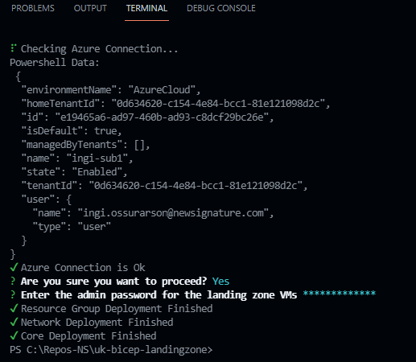
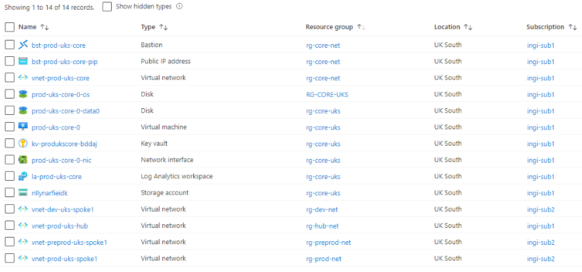

# Bicep Landing Zone

## Introduction
Create Landing Zone script in Bicep
:gl:
⌛

## Usage
The package can be used both localy or as part of pipeline.

Start with cloning the repo.  

Amend the config files with your own values.  
`./landing-zone/resource-groups.yaml` for the Resource Groups, location and subscription.  
`./landing-zone/environments.yaml` to add your own environments.  
`./landing-zone/networking.yaml` for your VNET needs.  
`./landing-zone/core.yaml` to amend core resources.  

>Note that supported resources are limited to existing resources used in these files.  

### For local use
Install NodeJS  
>Only versions 16.x and 17.x have been tested.  

Run below in Terminal of choice.  
```bash
# Install the required modules:  

npm install

# Convert the YAML config to JSON:  
npm start

# Deploy the Landing Zone:  
npm run deploy
```  
  

To clean up the resources used in the config, run the following in Terminal:  
```bash
npm run cleanup
```
This will delete the Resource Groups used in the `./landing-zone/resource-groups.yaml` file.  

### For pipeline use  
Clone this repo.  
Create new repo in GitHub or Azure DevOps.  

If using GitHub Actions:  
  
Use `.github/workflows/deploy-landingzone.yml` to deploy the Landing Zone package.  

If using Azure Pipeline:  
  
Use `.azure/pipelines.yml` to deploy the Landing Zone package.  


## Deployed Resources  
See below resources deployed as base core deployment into two subscriptions (not limited to two).

  
